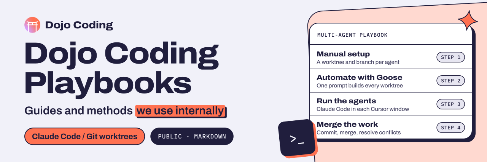

  <a href="https://dojocoding.io">
    <picture>
      <source media="(prefers-color-scheme: dark)" srcset="docs/assets/banner-dark.svg">
      <source media="(prefers-color-scheme: light)" srcset="docs/assets/banner-light.svg">
      
    </picture>
  </a>

# Dojo Coding Playbooks

**The practical guides Dojo Coding uses internally, shared with builders; the first one covers multi-agent development with Claude Code.**

**Centralizing Talent To Decentralize The Future**

   

[Multi-agent playbook](desarrollo-multi-agente-claude-code.md) · [What are playbooks](#what-are-playbooks) · [Get started](#ready-to-get-started) · [Report an issue](https://github.com/DojoCodingLabs/dojo-coding-playbooks/issues/new)

## What is Dojo Coding?

Dojo Coding is the leading Latin American ecosystem for technological talent development, specialized in **Web3**, **Artificial Intelligence**, and **Cybersecurity**. Our mission is to build a bridge between emerging talent from Latin America and global opportunities in decentralized technologies.

## Our Ecosystem

### **Academy**
We transform developers through:
- **High-impact training** in emerging technologies
- **"Learn while you earn" model** - monetize your skills from day one
- **Skill development** in Web3, AI, and cybersecurity
- **Global portfolios** that open international doors

### **Enterprise**
We implement technological solutions for companies:
- **Web3 and AI implementation** with Latin American expertise
- **Guaranteed results** backed by our certified talent
- **Specialized consulting** in decentralized technologies
- **Highly trained technical teams**

### **Launchpad**
We accelerate startups from idea to funding:
- **120-day program** from idea to funded startup
- **Guaranteed technical co-founder** to overcome technological barriers
- **Team formation** specialized in emerging technologies
- **Access to investor network** and ecosystem mentors

## Our Impact

| Metric | Achievement |
|---------|-------|
| 👨‍💻 **Developers Transformed** | 1,800+ |
| 💰 **Blockchain Grants Secured** | $700k+ |
| 👥 **Teams Formed** | 20+ |
| 🚀 **Startups Launched** | 8+ |
| 🌎 **Countries of Operation** | 8+ |

## Growth Paths

### For Developers
1. **Skill Mastery** - Specialize in future technologies
2. **Global Portfolio** - Build projects that impress worldwide
3. **Income Potential** - Monetize your skills from day one
4. **Startup Opportunities** - Become a technical co-founder

### For Companies
1. **Technical Implementation** - Take your company to the future with Web3 and AI
2. **Specialized Talent** - Access the best Latin American talent
3. **Measurable Results** - Implementations with guaranteed results
4. **Cost-Effectiveness** - High-quality solutions at competitive prices

### For Entrepreneurs
1. **Idea Validation** - Transform your concept into a viable MVP
2. **Technical Team** - Find your ideal technical co-founder
3. **Rapid Development** - From idea to product in 120 days
4. **Funding** - Connect with our investor network

## What are Playbooks?

This repository contains **official Dojo Coding playbooks**: practical guides, tutorials, and methodologies that we use internally and share with our community for:

- 🛠️ **AI Development** - Advanced assisted programming techniques
- 🔗 **Web3 Implementation** - Guides for blockchain and DeFi
- 🔐 **Cybersecurity** - Best practices and defensive tools
- 🚀 **Startup Development** - Proven methodologies for rapid launch
- 📈 **Technical Scaling** - Strategies for growing tech teams

## Recognition

Dojo Coding has been featured in leading industry publications:
- **DL News** - Recognition for innovation in Web3 education
- **CryptoSlate** - Coverage of our development programs
- **Redline Lab** - Strategic investment and support

## Global Community

Join our community of developers, entrepreneurs, and visionaries:

- 🌐 **Website**: [dojocoding.io](https://www.dojocoding.io/)
- 💼 **LinkedIn**: Follow our updates
- 🐦 **Twitter**: Latest ecosystem news
- 💬 **Discord**: Connect with the community
- 📧 **Newsletter**: Receive exclusive content

## Our Values

- **🌟 Excellence** - We seek maximum quality in everything we do
- **🤝 Collaboration** - We believe in the power of teamwork
- **🚀 Innovation** - We adopt the most advanced technologies
- **🌍 Impact** - We work to transform Latin America
- **📚 Learning** - We never stop growing and evolving

## Core Technologies

### Web3 & Blockchain
- Ethereum, Polygon, Binance Smart Chain
- Solidity, Rust, Go
- DeFi, NFTs, DAOs
- Layer 2 Solutions

### Artificial Intelligence
- Machine Learning, Deep Learning
- Claude Code, OpenAI, Anthropic
- Computer Vision, NLP
- MLOps, AI Deployment

### Cybersecurity
- Pentesting, Ethical Hacking
- Secure Development
- Blockchain Security Audits
- DevSecOps

## Ready to Get Started?

### For Developers
Want to transform your career and specialize in future technologies?
👉 **[Join the Academy](https://www.dojocoding.io/)**

### For Companies
Need to implement Web3 or AI in your organization?
👉 **[Explore Enterprise](https://www.dojocoding.io/)**

### For Entrepreneurs
Have an idea but need a technical co-founder?
👉 **[Accelerate your Startup](https://www.dojocoding.io/)**

---

  <strong>🥋 Dojo Coding - Where Latin American Talent Conquers the Tech World 🌎</strong>
  
  *Building the decentralized future, one developer at a time*

## Credits

Built by [Dojo Coding](https://dojocoding.io).

  

